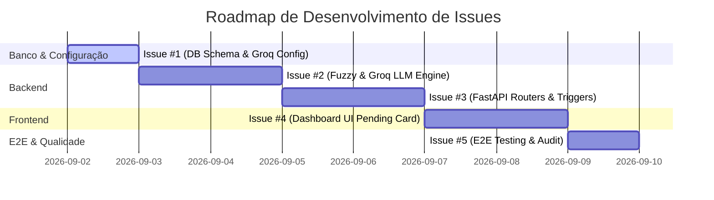

# Breakdown de Issues: Resolução Automática de Identidade de Coaches (Fuzzy + Groq LLM)

Este documento especifica o detalhamento em **5 Issues de Engenharia (User Stories & Tasks)** derivadas do PRD [`docs/superpowers/specs/2026-09-01-coach-identity-resolution-prd.md`](file:///c:/Users/artif/Documents/IGT/CONTABILIDADE%20PONTOS/contabilidade_pontos_py/docs/superpowers/specs/2026-09-01-coach-identity-resolution-prd.md).

---

## 📌 Visão Geral do Roadmap de Execução



---

### 🔹 Issue #1: [DB & Infra] Migration Supabase, Dependências e Variáveis de Ambiente

**Tipo:** `Infrastructure / Feature`  
**Prioridade:** `Alta`  
**Dependências:** Nenhum  

#### Descrição:
Criar a estrutura de tabela no Supabase para armazenar a fila de sugestões de aliases pendentes e configurar os pacotes Python e variáveis de ambiente necessários.

#### Tarefas:
- [ ] Criar arquivo de migração SQL `backend/admin/migrations/create_pending_aliases_table.sql`:
  ```sql
  CREATE TABLE IF NOT EXISTS pontos_ultimate_coach_aliases_pendentes (
      id SERIAL PRIMARY KEY,
      alias_raw VARCHAR NOT NULL UNIQUE,
      coach_sugerido VARCHAR NOT NULL,
      confianca NUMERIC(5,2) NOT NULL,
      origem VARCHAR NOT NULL DEFAULT 'groq-llm',
      status VARCHAR NOT NULL DEFAULT 'pendente',
      created_at TIMESTAMP WITH TIME ZONE DEFAULT CURRENT_TIMESTAMP,
      updated_at TIMESTAMP WITH TIME ZONE DEFAULT CURRENT_TIMESTAMP
  );
  ```
- [ ] Executar o script SQL no Supabase.
- [ ] Adicionar dependências no `backend/requirements.txt`: `groq>=0.9.0` e `rapidfuzz>=3.0.0`.
- [ ] Atualizar `.env.example` com as chaves:
  - `GROQ_API_KEY=""`
  - `GROQ_MODEL="llama-3.3-70b-versatile"`
  - `GROQ_TEMPERATURE="0.0"`

#### Critérios de Aceite:
- Tabela `pontos_ultimate_coach_aliases_pendentes` acessível e funcional no Supabase.
- Backend instalando os pacotes sem conflitos (`pip install -r requirements.txt`).

---

### 🔹 Issue #2: [Backend Engine] Implementação do Módulo Fuzzy Matching e Agente Groq LLM

**Tipo:** `Feature / Core Backend`  
**Prioridade:** `Alta`  
**Dependências:** Issue #1  

#### Descrição:
Implementar no backend o serviço responsável por calcular similaridade fuzzy via `rapidfuzz` e realizar a chamada estruturada à API da Groq para reconhecer apelidos e nomes parciais.

#### Tarefas:
- [ ] Criar o módulo `backend/coach_llm_service.py` com a classe `CoachIdentityEngine`.
- [ ] Implementar método `fuzzy_match(raw_name: str, canonical_list: list[str]) -> tuple[str | None, float]`:
  - Retorna a melhor correspondência e a pontuação usando `rapidfuzz.fuzz.WRatio`.
- [ ] Implementar método `llm_match_groq(raw_name: str, canonical_list: list[str]) -> tuple[str | None, float]`:
  - Chamar a API Groq com prompt estruturado solicitando resposta em formato JSON estrito:
    `{"coach_sugerido": "Nome Canônico", "confianca": 92.5}`.
- [ ] Implementar método principal `evaluate_unknown_coach(raw_name: str)` aplicando a regra das 4 camadas (Auto-aprovação para $\ge 95\%$, Fila de Pendentes para $70\%\text{--}94\%$).
- [ ] Escrever testes unitários em `backend/tests/test_coach_llm_service.py` com mocks para a API Groq.

#### Critérios de Aceite:
- Testes unitários passando com $100\%$ de cobertura nos fluxos de limiar ($<70\%$, $70\%\text{--}94\%$, $\ge 95\%$).
- Retorno seguro em formato JSON mesmo se o LLM enviar caracteres inesperados.

---

### 🔹 Issue #3: [Backend Router] Endpoints FastAPI para Gestão de Aliases e Disparo de Recálculo

**Tipo:** `Feature / API`  
**Prioridade:** `Alta`  
**Dependências:** Issue #2  

#### Descrição:
Expor os endpoints no router `backend/routers/contabilidade.py` para permitir a consulta, aprovação e rejeição de sugestões, além do gatilho sob demanda e disparo automático da função `reprocessar_coaches()`.

#### Tarefas:
- [ ] Implementar `POST /contabilidade/sugerir-aliases-llm`:
  - Varre nomes de coaches sem alias cadastrado e executa `CoachIdentityEngine`.
- [ ] Implementar `GET /contabilidade/aliases-pendentes`:
  - Lista os registros com `status = 'pendente'`.
- [ ] Implementar `POST /contabilidade/aprovar-alias-pendente`:
  - Insere o alias na tabela `pontos_ultimate_coach_aliases`.
  - Atualiza status para `'aprovado'`.
  - Dispara automaticamente `supabase_client.reprocessar_coaches()`.
- [ ] Implementar `POST /contabilidade/rejeitar-alias-pendente`:
  - Atualiza status para `'rejeitado'`.
- [ ] Integrar a avaliação no fluxo de ingestão de planilhas em `google_sheets_client.py`.

#### Critérios de Aceite:
- Todos os endpoints documentados no Swagger UI (`/docs`).
- Aprovação de alias gera automaticamente o recálculo dos totais dos coaches sem necessidade de chamadas manuais extras.

---

### 🔹 Issue #4: [Frontend UI] Card de Gestão de Aliases Sugeridos pela IA no Dashboard Admin

**Tipo:** `Frontend / UX`  
**Prioridade:** `Média`  
**Dependências:** Issue #3  

#### Descrição:
Criar um componente visual no Dashboard Admin (`frontend/src/pages/Dashboard.tsx` ou componente dedicado) para exibir as sugestões geradas pela IA e permitir a aprovação/rejeição com 1-clique.

#### Tarefas:
- [ ] Criar o componente `frontend/src/components/PendingAliasesCard.tsx`.
- [ ] Exibir contagem de pendências em badge de destaque.
- [ ] Tabela interativa contendo:
  - Nome digitado no formulário (`alias_raw`).
  - Sugestão do LLM (`coach_sugerido`) com campo de edição inline.
  - Tag de Confiança com cores dinâmicas (Verde para $\ge 90\%$, Amarelo para $< 90\%$).
  - Botão `[Aprovar]` (chama `POST /contabilidade/aprovar-alias-pendente`).
  - Botão `[Rejeitar]` (chama `POST /contabilidade/rejeitar-alias-pendente`).
- [ ] Exibir notificação de sucesso (Toast) ao aprovar: *"Alias aprovado! Ranking recalculado."*

#### Critérios de Aceite:
- Interface limpa, responsiva e com excelente estética visual.
- Atualização em tempo real da lista após clicar em Aprovar ou Rejeitar.

---

### 🔹 Issue #5: [E2E & Auditoria] Teste Integrado End-to-End e Validação de Consistência de Pontos

**Tipo:** `Quality Assurance / Testing`  
**Prioridade:** `Alta`  
**Dependências:** Issue #4  

#### Descrição:
Validar de ponta a ponta que a ingestão de um nome não padronizado passa pelas camadas de IA, é aprovado e reflete corretamente no ranking sem perda ou duplicação de pontos.

#### Tarefas:
- [ ] Criar o teste de integração `backend/tests/test_coach_identity_e2e.py`.
- [ ] Simular ingestão de registro com nome variado (ex: `"Vini Marini"`).
- [ ] Simular aprovação do alias para `"Vinicius Marini"`.
- [ ] Validar que a soma de pontos do coach `"Vinicius Marini"` corresponde à unificação exata dos registros.
- [ ] Garantir idempotência: rodar o reprocessamento 2x seguidas e conferir que 0 divergências foram geradas.

#### Critérios de Aceite:
- $100\%$ dos testes de integração passando no ambiente de CI (`pytest`).
- Auditoria de pontos zerada (nenhum ponto perdido ou duplicado).
