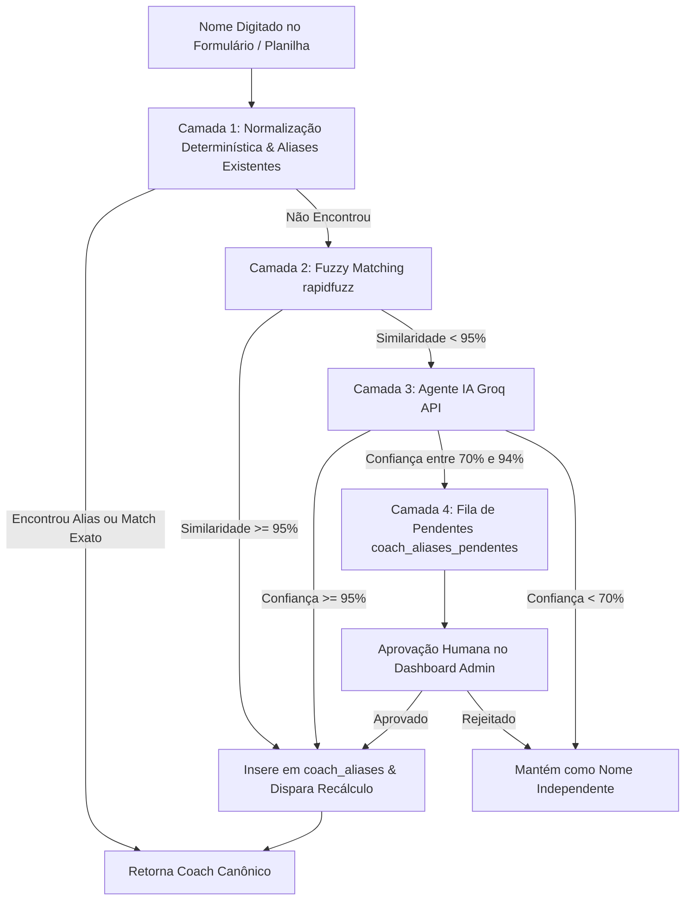

# PRD: Resolução Automática de Identidade de Coaches (Normalização, Fuzzy Matching & Agente IA Groq)

**Documento de Requisitos de Produto (PRD)**  
**Data:** 01/09/2026  
**Status:** Aprovado / Em Planejamento  
**Repositório:** `Alberanif/contabilidade_pontos_py`  
**Autor:** Antigravity AI & Time de Engenharia IGT  

---

## 1. Visão Geral e Contexto Executivo

No sistema de contabilidade de pontos do IGT Ultimate, a atribuição de pontos por coach individual depende do preenchimento de formulários de texto livre. Devido à falta de padronização nas entradas manuais (erros de digitação, variação de maiúsculas/minúsculas, acentuação, nomes parciais, sobrenomes omitidos e apelidos), a mesma pessoa física acaba sendo registrada sob múltiplas grafias distintas.

Essa fragmentação corrompe o ranking individual de coaches no Dashboard, dividindo os pontos acumulados por um mesmo coach entre diferentes linhas.

Este PRD especifica a arquitetura e a implementação de uma **solução híbrida em 4 camadas (Normalização Determinística $\rightarrow$ Fuzzy Matching $\rightarrow$ Agente IA Groq $\rightarrow$ Human-in-the-Loop)** para identificar, unificar e consolidar a pontuação de cada coach de forma precisa, performática e de baixo custo.

---

## 2. Objetivos e Métricas de Sucesso

### 2.1 Objetivos Principais
1. **Unificação Automática de Registros:** Agrupar automaticamente variações de grafia conhecidas e triviais sem intervenção humana e sem custo de API.
2. **Resolução Inteligente via LLM (Groq):** Utilizar o modelo `llama-3.3-70b-versatile` da Groq para reconhecer apelidos e nomes parciais com alta precisão semestral/contextual.
3. **Cache Permanente via Aliases:** Gravar todo mapeamento resolvido na tabela `pontos_ultimate_coach_aliases`, garantindo que futuras ocorrências do mesmo alias sejam resolvidas em milissegundos.
4. **Governança com Human-in-the-Loop:** Fornecer um fluxo de aprovação com 1-clique no Dashboard para sugestões com grau de confiança intermediário (70% a 94%).
5. **Recálculo Automático e Idempotente:** Recalcular automaticamente o ranking e histórico de pontos dos coaches afetados a cada aprovação de alias.

### 2.2 Métricas de Sucesso (KPIs)
- **Precisão de Agrupamento:** $> 99\%$ de acurácia no ranking individual de coaches.
- **Taxa de Resolução Instantânea (Camadas 1 e 2):** $> 85\%$ dos nomes ingeridos resolvidos sem necessidade de chamada externa a LLM.
- **Custo por Ingestão:** Manutenção do custo de chamadas de API próximo de zero através do reaproveitamento da tabela de aliases.
- **Tempo de Resposta do Dashboard:** $< 200\text{ ms}$ para carregamento das pontuações consolidadas.

---

## 3. Escopo

### 3.1 Dentro do Escopo (In-Scope)
- Algoritmo de normalização determinística (`normalize_key`).
- Integração da biblioteca `rapidfuzz` para correspondência fuzzy de alta confiança.
- Integração com a API Groq (utilizando o modelo `llama-3.3-70b-versatile` ou equivalente rápido).
- Criação da tabela Supabase `pontos_ultimate_coach_aliases_pendentes`.
- Endpoints de backend para execução sob demanda (`POST /contabilidade/sugerir-aliases-llm`), aprovação e rejeição de sugestões.
- Gatilho automático de análise durante a ingestão de planilhas Google Sheets.
- Interface visual (Card/Aba) no Dashboard Frontend para o administrador revisar sugestões pendentes com exibição do percentual de confiança.
- Disparo automático da rotina `reprocessar_coaches()` ao aprovar aliases.

### 3.2 Fora do Escopo (Out-of-Scope)
- Alteração da interface dos formulários de origem (Google Forms/Planilhas permanecerão como campo de texto livre).
- Tratamento de nomes de Clãs (a normalização de clãs já segue regra própria).

---

## 4. Arquitetura da Solução em 4 Camadas

O pipeline de resolução de identidade de coach seguirá o fluxo hierárquico abaixo:



### Detalhamento das Camadas

| Camada | Mecanismo | Critério / Regra | Ação | Custo / Latência |
|---|---|---|---|---|
| **Camada 1** | Normalização & Map Lookup | `normalize_key(raw)` (remover acentos, espaços extras, caixa alta) + Busca na tabela `pontos_ultimate_coach_aliases` | Mapeia para o `coach_canonico` | $0\text{ R\$}$ / $< 1\text{ ms}$ |
| **Camada 2** | `rapidfuzz` Similarity | Razão de similaridade de Levenshtein/Jaro-Winkler $\ge 95\%$ com coaches oficiais existentes | Auto-aprova, grava em `coach_aliases` e recalcula | $0\text{ R\$}$ / $< 2\text{ ms}$ |
| **Camada 3** | Agente IA Groq | Prompt estruturado com `llama-3.3-70b-versatile` comparando o nome bruto com a lista de coaches oficiais | $\ge 95\%$: Auto-aprova<br>$70\%\text{--}94\%$: Envia para Fila de Pendentes<br>$< 70\%$: Não altera | Custo mínimo Groq / $\approx 300\text{ ms}$ |
| **Camada 4** | Human-in-the-Loop | Card interativo no Frontend Admin listando os pares sugeridos | Admin clica em `[Aprovar]`, `[Rejeitar]` ou `[Editar]` | Manual (1 clique) |

---

## 5. Modelagem de Dados (Supabase)

### 5.1 Tabela Existente: `pontos_ultimate_coach_aliases`
Armazena os aliases confirmados e ativos.
```sql
CREATE TABLE IF NOT EXISTS pontos_ultimate_coach_aliases (
    id SERIAL PRIMARY KEY,
    alias VARCHAR NOT NULL UNIQUE,
    coach_canonico VARCHAR NOT NULL,
    created_at TIMESTAMP WITH TIME ZONE DEFAULT CURRENT_TIMESTAMP
);
```

### 5.2 Nova Tabela: `pontos_ultimate_coach_aliases_pendentes`
Armazena as sugestões geradas pela IA Groq que exigem revisão humana.
```sql
CREATE TABLE IF NOT EXISTS pontos_ultimate_coach_aliases_pendentes (
    id SERIAL PRIMARY KEY,
    alias_raw VARCHAR NOT NULL UNIQUE,
    coach_sugerido VARCHAR NOT NULL,
    confianca NUMERIC(5,2) NOT NULL, -- ex: 88.50
    origem VARCHAR NOT NULL DEFAULT 'groq-llm', -- 'groq-llm' ou 'rapidfuzz'
    status VARCHAR NOT NULL DEFAULT 'pendente', -- 'pendente', 'aprovado', 'rejeitado'
    created_at TIMESTAMP WITH TIME ZONE DEFAULT CURRENT_TIMESTAMP,
    updated_at TIMESTAMP WITH TIME ZONE DEFAULT CURRENT_TIMESTAMP
);
```

---

## 6. Especificação das APIs Backend (FastAPI)

### 6.1 `POST /contabilidade/sugerir-aliases-llm`
Varre todos os nomes de coaches registrados no banco que ainda não possuem alias mapeado, roda a avaliação do Groq em lote/assíncrona e popula a fila de pendentes (ou auto-aprova se confiança $\ge 95\%$).

- **Resposta de Sucesso (200 OK):**
```json
{
  "total_analisados": 14,
  "auto_aprovados": 3,
  "enviados_para_fila": 8,
  "sem_correspondencia": 3,
  "mensagem": "Análise concluída com sucesso."
}
```

### 6.2 `GET /contabilidade/aliases-pendentes`
Retorna a lista de sugestões pendentes de aprovação para exibição no Dashboard.

- **Resposta de Sucesso (200 OK):**
```json
[
  {
    "id": 102,
    "alias_raw": "Vini Marini",
    "coach_sugerido": "Vinicius Marini",
    "confianca": 92.5,
    "origem": "groq-llm",
    "created_at": "2026-09-01T21:40:00Z"
  }
]
```

### 6.3 `POST /contabilidade/aprovar-alias-pendente`
Aprova uma sugestão pendente, insere na tabela `pontos_ultimate_coach_aliases` e dispara automaticamente a rotina `reprocessar_coaches()`.

- **Body da Requisição:**
```json
{
  "id_pendente": 102,
  "coach_canonico_override": null
}
```

### 6.4 `POST /contabilidade/rejeitar-alias-pendente`
Marca a sugestão como `rejeitada`, impedindo que ela reapareça na fila de sugestões.

---

## 7. Requisitos de Interface (Frontend Dashboard Admin)

Um novo componente/card chamado **"Sugestões de Aliases de Coaches (IA)"** será adicionado no Dashboard Administrativo (`frontend/src/pages/Dashboard.tsx` ou modal dedicado):

1. **Badge de Pendências:** Indicador visual com a contagem de aliases pendentes de revisão.
2. **Tabela de Revisão:**
   - Coluna **Nome Digitado (Alias)**.
   - Coluna **Sugestão da IA (Canônico)** (editável inline ou via input modal).
   - Coluna **Nível de Confiança** (com tag de cor: Verde $\ge 90\%$, Amarelo $70\%\text{--}89\%$).
   - Coluna de **Ações:** Botões `[Aprovar]` e `[Rejeitar]`.
3. **Feedback em Tempo Real:** Ao aprovar um alias, o sistema exibe notificação toast de sucesso (*"Alias aprovado e ranking recalculado automaticamente"*).

---

## 8. Configurações de Ambiente (`.env`)

Serão adicionadas as seguintes variáveis no arquivo `.env` do backend:
```env
# Groq API Configuration
GROQ_API_KEY="gsk_..."
GROQ_MODEL="llama-3.3-70b-versatile"
GROQ_TEMPERATURE="0.0"
```

---

## 9. Plano de Testes e Validação

1. **Testes Unitários:**
   - Teste de `normalize_key`: validação de case, acentos e espaços.
   - Teste de `rapidfuzz_match`: validação de pontuação de similaridade acima e abaixo de 95%.
   - Teste do serviço Groq: mock da resposta em JSON da API Groq.
2. **Testes de Integração:**
   - Testar o fluxo completo de aprovação: inserir pendente $\rightarrow$ aprovar $\rightarrow$ verificar inserção em `coach_aliases` $\rightarrow$ verificar execução de `reprocessar_coaches()`.
3. **Teste de Idempotência:**
   - Rodar a reavaliação de aliases múltiplas vezes garantindo que nenhum alias duplicado seja inserido e nenhum ponto seja corrompido.

---

## 10. Plano de Deploy e Rollout

1. **Fase 1 (Banco de Dados):** Execução do script SQL de criação da tabela `pontos_ultimate_coach_aliases_pendentes` no Supabase.
2. **Fase 2 (Backend):** Adição da biblioteca `rapidfuzz` e `groq` no `requirements.txt`, implementação das funções em `coach_identity.py` e rotas em `routers/contabilidade.py`.
3. **Fase 3 (Frontend):** Implementação do card de gestão de sugestões no Dashboard Admin.
4. **Fase 4 (Publicação & Homologação):** Push para o repositório remoto e validação dos testes automatizados.

---

**Aprovado por:**  
- *Engenharia IGT*  
- *Antigravity Agentic AI*  
