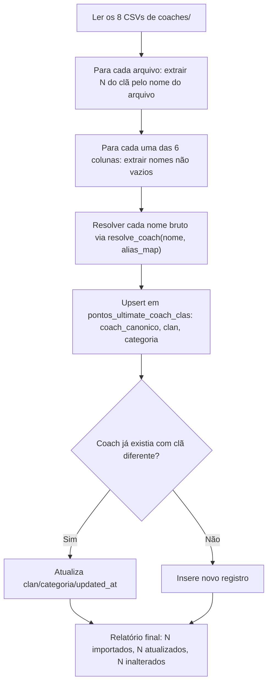

# PRD: Cadastro de Coaches por Clã

**Documento de Requisitos de Produto (PRD)**
**Data:** 10/09/2026
**Status:** Proposto — aguardando planejamento técnico
**Repositório:** `Alberanif/contabilidade_pontos_py`
**Autor:** Claude Sonnet 5 & Time de Engenharia IGT

---

## 1. Visão Geral e Contexto Executivo

Hoje, todo registro de pontuação (Registros pagantes, Pro-bono, Desafios) traz o clã do coach como um campo de **texto autodeclarado** pela própria pessoa no formulário de origem. Não existe, em nenhum lugar do sistema, um cadastro independente que diga "o Coach X pertence ao Clã Y" — o clã só é conhecido através do que foi digitado naquele registro específico.

Isso limita a precisão da contabilidade de pontos por dois motivos:

1. **Nenhuma fonte de verdade além do autorrelato.** Se um coach preencher o clã errado (ou deixar em branco, no caso de fontes que não têm esse campo), não há como o sistema saber automaticamente qual é o clã correto dele.
2. **Nenhum cadastro central da composição dos clãs.** O time de operação organiza os clãs e a categoria de cada coach (Coach, Coach Action, Coach Pro, Coach Hero, Sem Categoria, Novos ULTIMATES) em planilhas soltas (pasta `coaches/` do repositório, exportada de `[EDIÇÃO] ULTIMATES _ Clãs _ Agosto 26.xlsx`), sem espelho nenhum no sistema de contabilidade.

Este PRD especifica a criação de um **cadastro central coach → clã → categoria**: uma nova tabela no Supabase, um script de importação one-off a partir dos CSVs já existentes na pasta `coaches/`, e uma nova página administrativa **"Coaches por Clã"** no frontend para consultar e manter esse cadastro.

**Importante — escopo desta fase:** este cadastro é **apenas referência/catálogo**. Ele não altera em nada a lógica de contabilização de pontos hoje em vigor (Registros, Pro-bono, Desafios continuam usando o clã autodeclarado nas respectivas planilhas). Usar este cadastro para validar, sinalizar divergências ou substituir o clã autodeclarado na contabilização fica explicitamente fora de escopo, para uma fase futura.

---

## 2. Objetivos e Métricas de Sucesso

### 2.1 Objetivos Principais
1. **Fonte de verdade única para "quem está em qual clã".** Centralizar em uma tabela do Supabase a composição de cada um dos 8 clãs, hoje espalhada em planilhas soltas.
2. **Seed automático a partir dos dados já organizados.** Importar de uma vez os 154 coaches já catalogados nos 8 CSVs da pasta `coaches/`, sem digitação manual.
3. **Identidade consistente com o resto do sistema.** Cada nome importado é resolvido contra a tabela de aliases (`pontos_ultimate_coach_aliases`) já usada no ranking de pontos, para que o mesmo coach tenha o mesmo nome canônico nos dois lugares.
4. **Gestão contínua sem depender de reimportação de CSV.** Uma tela administrativa permite adicionar, mover de clã, editar categoria e remover coaches após o seed inicial.
5. **Base para evoluções futuras.** Deixar a tabela pronta para, em uma fase posterior, ser usada na validação ou derivação do clã na contabilização de pontos de desafios.

### 2.2 Métricas de Sucesso (KPIs)
- **Cobertura do seed:** 100% dos 154 nomes presentes nos 8 CSVs de `coaches/` importados com sucesso (clã + categoria corretos).
- **Consistência de identidade:** 0 coaches com nome divergente do canônico usado em `pontos_ultimate_totais_por_coach` para a mesma pessoa (quando já existe alias cadastrado).
- **Integridade:** 0 coaches com mais de um clã atribuído simultaneamente (constraint de unicidade no banco).
- **Usabilidade admin:** operação de mover um coach de clã completada em ≤ 3 cliques na nova tela.

---

## 3. Escopo

### 3.1 Dentro do Escopo (In-Scope)
- Nova tabela Supabase `pontos_ultimate_coach_clas` (coach canônico → clã → categoria).
- Script de importação one-off (`backend/admin/importar_coaches_por_cla.py`) que lê os 8 CSVs de `coaches/`, resolve cada nome via `coach_identity.resolve_coach()` + `get_coach_alias_map()`, e faz upsert idempotente na tabela.
- Endpoints de backend (CRUD) para listar, criar, atualizar e remover vínculos coach → clã.
- Nova página no frontend, **"Coaches por Clã"**, com rota própria e item de menu próprio, para visualizar os 8 clãs e seus coaches, e realizar as operações de CRUD.
- Validação de categoria contra uma lista fixa de 6 valores conhecidos (dropdown, não texto livre).
- Constraint de unicidade: um coach canônico pertence a exatamente um clã.
- Reimportação idempotente: rodar o script novamente com um CSV atualizado atualiza o clã/categoria de coaches já existentes, sem duplicar.

### 3.2 Fora do Escopo (Out-of-Scope)
- Qualquer alteração na lógica de contabilização de pontos (Registros, Pro-bono, Desafios) — o clã autodeclarado nas planilhas de origem continua sendo o único usado para pontuar.
- Validação cruzada ou substituição do clã autodeclarado usando este novo cadastro.
- Histórico/versionamento por edição (ex.: "Agosto 26") — a tabela guarda apenas o vínculo vigente; trocar o clã de um coach sobrescreve o valor anterior, sem manter rastro do estado passado.
- Sinalização de coaches que têm pontos no sistema (`pontos_ultimate_totais_por_coach`) mas não aparecem em nenhum dos 8 CSVs — a nova tela exibe **apenas** os coaches presentes nos arquivos-fonte.
- Exibição de pontuação (totais, ranking) na nova tela — ela é dedicada exclusivamente à organização clã/categoria/nome.
- Criação ou edição de aliases de coach (`pontos_ultimate_coach_aliases`) a partir desta feature — ela **consome** o alias map existente, mas não escreve nele.
- Qualquer mudança em planilhas Google Sheets — esta feature não usa Google Sheets como fonte ou destino.

---

## 4. Fatos de Origem (Pasta `coaches/`)

A pasta `coaches/` contém 8 arquivos CSV, um por clã, exportados de `[EDIÇÃO] ULTIMATES _ Clãs _ Agosto 26.xlsx`:

```
coaches/[EDIÇÃO] ULTIMATES _ Clãs _ Agosto 26.xlsx - Clã 1.csv
coaches/[EDIÇÃO] ULTIMATES _ Clãs _ Agosto 26.xlsx - Clã 2.csv
...
coaches/[EDIÇÃO] ULTIMATES _ Clãs _ Agosto 26.xlsx - Clã 8.csv
```

Cada arquivo tem 6 colunas fixas:

| Coach | Coach Action | Coach Pro | Coach Hero | Sem Categoria | Novos ULTIMATES |
|---|---|---|---|---|---|

Cada coluna pode ter de 0 a N nomes (uma pessoa por linha; colunas com menos nomes ficam com células vazias ao final). Levantamento feito nos dados atuais:

- **154 nomes únicos** no total, distribuídos pelos 8 clãs.
- **Zero sobreposição entre clãs** — nenhum nome aparece em mais de um arquivo hoje, o que confirma que a regra "1 coach = 1 clã" é compatível com os dados reais.
- Nem todo clã tem alguém na coluna "Coach" (ex.: Clã 4 e Clã 8 estão com essa célula vazia na primeira linha) — a categoria "Coach" não é obrigatória por clã.

O número do clã (1–8) vem do próprio nome do arquivo (`... - Clã N.csv`); a categoria vem do nome da coluna onde o nome aparece.

---

## 5. Modelagem de Dados (Supabase)

### 5.1 Nova Tabela: `pontos_ultimate_coach_clas`

```sql
CREATE TABLE IF NOT EXISTS pontos_ultimate_coach_clas (
    id SERIAL PRIMARY KEY,
    coach_canonico VARCHAR NOT NULL UNIQUE,
    clan VARCHAR NOT NULL,
    categoria VARCHAR NOT NULL
        CHECK (categoria IN (
            'Coach', 'Coach Action', 'Coach Pro', 'Coach Hero',
            'Sem Categoria', 'Novos ULTIMATES'
        )),
    created_at TIMESTAMP WITH TIME ZONE DEFAULT CURRENT_TIMESTAMP,
    updated_at TIMESTAMP WITH TIME ZONE DEFAULT CURRENT_TIMESTAMP
);

CREATE INDEX IF NOT EXISTS idx_coach_clas_clan
    ON pontos_ultimate_coach_clas(clan);
```

**Decisões de modelagem:**
- `coach_canonico UNIQUE` impõe a regra "1 coach = 1 clã" no nível do banco — uma tentativa de inserir o mesmo coach em dois clãs falha ou (via upsert) atualiza o registro existente, nunca duplica.
- `clan` usa a mesma grafia canônica já usada no resto do sistema (`CLÃ 1` .. `CLÃ 8`, conforme `normalize_clan()` em `desafio_sheet_parser.py`), para manter consistência textual com o restante do código.
- `categoria` é restrita por `CHECK` às 6 categorias conhecidas hoje. Adicionar uma 7ª categoria no futuro exige uma migração (alterar o `CHECK`) — decisão deliberada para privilegiar consistência de dados sobre flexibilidade.
- Sem coluna de "edição/temporada": a tabela reflete só o vínculo vigente, sem histórico (ver §3.2).

### 5.2 Migração

Novo arquivo `backend/migrations/011_add_coach_clas.sql` contendo o `CREATE TABLE` acima, seguindo a numeração sequencial das migrações existentes (a última é `010_migrate_legacy_desafio_contribution.sql`).

---

## 6. Script de Importação (Seed)

**Arquivo:** `backend/admin/importar_coaches_por_cla.py` (mesmo padrão dos scripts administrativos existentes em `backend/admin/`, ex. `migrate_desafios_google_sheet.py`).

### 6.1 Comportamento



1. Para cada um dos 8 arquivos, extrai o número do clã a partir do nome do arquivo (`... - Clã N.csv` → `CLÃ N`).
2. Para cada uma das 6 colunas (Coach, Coach Action, Coach Pro, Coach Hero, Sem Categoria, Novos ULTIMATES), itera as células não vazias daquela coluna.
3. Para cada nome bruto, chama `coach_identity.resolve_coach(nome_bruto, alias_map)` (usando `supabase_client.get_coach_alias_map()`) para obter o nome canônico — a mesma função já usada em `reprocessar_coaches` e na resolução de coach de desafios.
4. Faz upsert em `pontos_ultimate_coach_clas` por `coach_canonico` (`ON CONFLICT (coach_canonico) DO UPDATE SET clan = EXCLUDED.clan, categoria = EXCLUDED.categoria, updated_at = now()`), permitindo rodar o script novamente no futuro com um CSV atualizado sem duplicar nem falhar.
5. Ao final, imprime um relatório: total de nomes processados, quantos foram inseridos, quantos foram atualizados (clã ou categoria mudou) e quantos ficaram inalterados.

### 6.2 Execução

Script `dry-run` por padrão (mostra o que faria sem gravar), com flag `--apply` para efetivar — mesmo padrão de `migrate_desafios_google_sheet.py --apply`.

```bash
python backend/admin/importar_coaches_por_cla.py           # dry-run
python backend/admin/importar_coaches_por_cla.py --apply   # grava no Supabase
```

### 6.3 Reimportação futura

O script é seguro para rodar mais de uma vez (idempotente). Se uma futura edição trouxer um coach que mudou de clã, basta atualizar o CSV correspondente na pasta `coaches/` e rodar o script novamente com `--apply` — o vínculo antigo é sobrescrito pelo novo, sem intervenção manual no banco.

---

## 7. Especificação das APIs Backend (FastAPI)

Novo router `backend/routers/coach_clas.py`, montado em `/api/coach-clas` (padrão dos demais routers: `routers/coaches.py`, `routers/clans.py`).

### 7.1 `GET /api/coach-clas`
Lista todos os vínculos coach → clã → categoria.

- **Resposta de Sucesso (200 OK):**
```json
[
  { "coach_canonico": "Flavio Britto", "clan": "CLÃ 1", "categoria": "Coach" },
  { "coach_canonico": "Cler Duarte Silva", "clan": "CLÃ 1", "categoria": "Coach Action" }
]
```
- Suporta filtro opcional `?clan=CLÃ%201` para retornar só os coaches de um clã.

### 7.2 `POST /api/coach-clas`
Adiciona um novo coach a um clã.

- **Body:**
```json
{ "coach": "Novo Nome", "clan": "CLÃ 3", "categoria": "Coach Pro" }
```
- O nome recebido passa por `resolve_coach()` antes de gravar (mesma regra do script de importação).
- Retorna **409 Conflict** se o coach (já resolvido para o canônico) já estiver vinculado a outro clã — a UI deve orientar o usuário a **mover** o coach em vez de criar um vínculo novo.

### 7.3 `PUT /api/coach-clas/{coach_canonico}`
Atualiza o clã e/ou categoria de um coach já cadastrado (operação de "mover de clã" / "editar categoria").

- **Body:**
```json
{ "clan": "CLÃ 5", "categoria": "Coach Hero" }
```

### 7.4 `DELETE /api/coach-clas/{coach_canonico}`
Remove o vínculo do coach com qualquer clã (o coach deixa de aparecer no cadastro; isso **não** afeta seus pontos em `pontos_ultimate_totais_por_coach`).

### 7.5 Camada de dados (`supabase_client.py`)

Novas funções:
- `list_coach_clas(clan: str | None = None) -> list[dict]`
- `upsert_coach_cla(coach_canonico: str, clan: str, categoria: str) -> dict`
- `delete_coach_cla(coach_canonico: str) -> None`

---

## 8. Requisitos de Interface (Frontend)

### 8.1 Nova rota e item de menu

- Rota: `/coaches-por-cla`.
- Página: `frontend/src/pages/CoachesPorCla.tsx`.
- Item de menu próprio em `frontend/src/components/Layout.tsx`, com o rótulo **"Coaches por Clã"** — nome escolhido deliberadamente para não ser confundido com a aba/seção "Coaches" já existente no Dashboard (que é o ranking de pontos por coach, uma tela totalmente diferente e sem relação direta com esta feature).

### 8.2 Layout da página

- Uma seção por clã (8 no total, `CLÃ 1` a `CLÃ 8`), cada uma listando seus coaches com a respectiva categoria (ex.: reaproveitando o estilo visual de `ClanCard.tsx`, mas expandido para mostrar a lista de nomes, não só o total de pontos).
- Cada linha de coach mostra: **Nome (canônico)** · **Categoria** (badge/tag) · ações **Editar** / **Mover de clã** / **Remover**.
- Botão **"+ Adicionar coach"** por clã (ou um único botão global com seletor de clã no formulário), abrindo um formulário com: nome do coach (texto), clã (dropdown, 8 opções), categoria (dropdown, 6 opções fixas).
- Ao tentar adicionar um coach que já pertence a outro clã, a UI exibe o erro 409 do backend com uma mensagem clara (ex.: *"Este coach já está no CLÃ 2. Use 'Mover de clã' em vez de adicionar."*) e sugere a ação de mover.
- Sem exibição de pontos/totais nesta tela — filtro e busca são só por nome/categoria/clã.
- Busca simples por nome (client-side, dado o volume de ~154 registros) para localizar rapidamente um coach.

### 8.3 `src/api/client.ts`

Novas funções: `fetchCoachClas(clan?: string)`, `createCoachCla(payload)`, `updateCoachCla(coachCanonico, payload)`, `deleteCoachCla(coachCanonico)`.

---

## 9. Plano de Testes e Validação

### 9.1 Backend — Unitários (`backend/tests/`)
- `test_importar_coaches_por_cla.py`:
  - parsing correto do número do clã a partir do nome do arquivo;
  - todas as 6 colunas são lidas e mapeadas para a categoria correta;
  - células vazias são ignoradas;
  - nome bruto é resolvido via `resolve_coach()` antes do upsert (usar alias map mockado com um alias conhecido);
  - reimportação com o mesmo CSV é idempotente (nenhuma duplicata, nenhuma mudança nos "inalterados");
  - reimportação com um coach movido de clã atualiza o registro existente (upsert), não cria um segundo.
- `test_coach_clas_supabase_client.py` (ou equivalente): `list_coach_clas`, `upsert_coach_cla`, `delete_coach_cla` com Supabase mockado.
- `test_coach_clas_router.py`: CRUD dos 4 endpoints, incluindo o caso de conflito (409) ao tentar adicionar um coach que já está em outro clã, e validação de categoria fora da lista fixa (erro 422).

### 9.2 Integração / e2e
- Fluxo completo: rodar o script de importação (dry-run e depois `--apply`) contra os CSVs reais de `coaches/` em um ambiente de teste, e validar que os 154 nomes ficam corretamente distribuídos nos 8 clãs com as categorias certas.
- Fluxo de API: criar → mover de clã → editar categoria → remover, validando o estado final via `GET /api/coach-clas`.

### 9.3 Frontend (`vitest`)
- `CoachesPorCla.test.tsx`: renderização dos 8 clãs com seus coaches; fluxo de adicionar coach (incluindo o erro 409 tratado na UI); fluxo de mover de clã; fluxo de remover com confirmação.

---

## 10. Plano de Deploy e Rollout

1. **Fase 1 (Banco de Dados):** aplicar a migração `011_add_coach_clas.sql` no Supabase.
2. **Fase 2 (Backend):** implementar `coach_identity`-reuse no script de importação, as funções em `supabase_client.py` e o router `coach_clas.py`; rodar a suíte de testes unitários.
3. **Fase 3 (Seed):** rodar `importar_coaches_por_cla.py` em modo dry-run, revisar o relatório, depois rodar com `--apply` em produção.
4. **Fase 4 (Frontend):** implementar a página "Coaches por Clã", o item de menu e o cliente de API; validar visualmente os 8 clãs contra os CSVs de origem.
5. **Fase 5 (Homologação):** conferir manualmente uma amostra de coaches (incluindo pelo menos um de cada categoria) contra os CSVs originais da pasta `coaches/`.

---

## 11. Riscos

| Risco | Mitigação |
|---|---|
| Duas grafias diferentes do mesmo coach em colunas/arquivos distintos, sem alias cadastrado ainda, geram dois registros canônicos diferentes para a mesma pessoa | Recomenda-se rodar `POST /contabilidade/sugerir-aliases-llm` e aprovar os aliases pendentes **antes** de rodar o seed, reduzindo o risco; casos residuais são corrigíveis depois via "Mover de clã" / remoção manual na nova tela |
| Um coach passa a existir em `pontos_ultimate_coach_clas` mas nunca aparece em `pontos_ultimate_totais_por_coach` (ainda não pontuou) ou vice-versa | Aceito nesta fase — as duas tabelas são independentes por design (§3.2); não há sinalização cruzada nesta entrega |
| Futuras edições recategorizarem os coaches (ex.: renomear "Sem Categoria") | O `CHECK` da coluna `categoria` exige migração explícita para novas categorias — risco conhecido, aceito em troca de proteção contra erro de digitação |
| Reimportação acidental sobrescrever uma edição manual feita via UI (ex.: alguém moveu um coach na tela, depois alguém roda o script antigo) | Script sempre requer `--apply` explícito e imprime relatório de "atualizados" antes de gravar, dando chance de revisão; recomenda-se documentar no runbook que o CSV de origem deve estar atualizado antes de qualquer reimportação |

---

## 12. Fora de Escopo / Evoluções Futuras

- Usar `pontos_ultimate_coach_clas` para validar ou substituir o clã autodeclarado na contabilização de pontos de desafios (§3.2).
- Relatório de "coaches com pontos mas sem clã cadastrado".
- Histórico/versionamento por edição/temporada.
- Exibição de pontuação na tela "Coaches por Clã".

---

**Aprovado por:**
- *Engenharia IGT*
- *Claude Sonnet 5 (Anthropic)*
