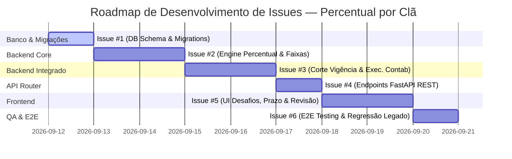

# Breakdown de Issues: Apuração de Desafios por Clã — Percentual de Participação

Este documento especifica o detalhamento em **6 Issues de Engenharia (User Stories & Tasks)** derivadas do PRD [`docs/superpowers/specs/2026-09-11-desafios-percentual-por-cla-prd.md`](file:///c:/Users/artif/Documents/IGT/CONTABILIDADE%20PONTOS/contabilidade_pontos_py/docs/superpowers/specs/2026-09-11-desafios-percentual-por-cla-prd.md).

---

## 📌 Visão Geral do Roadmap de Execução



---

### 🔹 Issue #1: [DB & Migrations] Schema Supabase, Colunas de Prazo e Tabelas de Apuração e Revisão

**Tipo:** `Infrastructure / DB Migration`  
**Prioridade:** `Alta`  
**Dependências:** Nenhum  

#### Descrição:
Criar a estrutura de banco de dados no Supabase para suportar o fluxo de revisão manual por submissão (pós-corte de vigência), a gestão de prazos por desafio e a gravação auditável das apurações de engajamento por clã.

#### Tarefas:
- [ ] Criar o arquivo de migração SQL `backend/migrations/012_add_desafio_percentual_clan.sql`:
  ```sql
  -- 1. Tabela de revisões manuais por submissão
  CREATE TABLE IF NOT EXISTS desafio_submissao_revisoes (
      token         TEXT PRIMARY KEY REFERENCES desafio_submissions_current(token) ON DELETE CASCADE,
      status        TEXT NOT NULL DEFAULT 'pendente'
                        CHECK (status IN ('pendente', 'aprovado', 'reprovado')),
      revisado_por  TEXT,
      revisado_em   TIMESTAMPTZ,
      created_at    TIMESTAMPTZ NOT NULL DEFAULT NOW(),
      updated_at    TIMESTAMPTZ NOT NULL DEFAULT NOW()
  );

  CREATE INDEX IF NOT EXISTS ix_desafio_submissao_revisoes_status
      ON desafio_submissao_revisoes (status);

  -- 2. Novas colunas na tabela desafios
  ALTER TABLE desafios ADD COLUMN IF NOT EXISTS prazo_apuracao TIMESTAMPTZ;
  ALTER TABLE desafios ADD COLUMN IF NOT EXISTS apurado_em TIMESTAMPTZ;

  -- 3. Tabela de resultados de apuração por clã
  CREATE TABLE IF NOT EXISTS desafio_clan_apuracoes (
      id                    SERIAL PRIMARY KEY,
      desafio_id            INTEGER NOT NULL REFERENCES desafios(id) ON DELETE CASCADE,
      clan                  TEXT NOT NULL,
      participantes         INTEGER NOT NULL CHECK (participantes >= 0),
      total_grupo           INTEGER NOT NULL CHECK (total_grupo >= 0),
      percentual            NUMERIC NOT NULL,
      pontos                INTEGER NOT NULL CHECK (pontos >= 0),
      apurado_em            TIMESTAMPTZ NOT NULL DEFAULT NOW(),
      UNIQUE (desafio_id, clan)
  );
  ```
- [ ] Executar o script SQL de migração no Supabase.
- [ ] Adicionar a constante de vigência em `backend/config.py`:
  ```python
  from datetime import date
  DESAFIO_PERCENTUAL_CLAN_CORTE = date(2026, 8, 1)
  ```

#### Critérios de Aceite:
- Migração `012_add_desafio_percentual_clan.sql` aplicada no banco sem erros.
- Tabelas `desafio_submissao_revisoes`, `desafio_clan_apuracoes` e colunas em `desafios` acessíveis e funcionais via client Supabase.

---

### 🔹 Issue #2: [Core Engine] Motor de Cálculo por Percentual de Participação, Tabela de Faixas e Resolução de Clãs

**Tipo:** `Feature / Core Backend`  
**Prioridade:** `Alta`  
**Dependências:** Issue #1  

#### Descrição:
Implementar a função pura de cálculo por percentual de participação (tabela de faixas) e o algoritmo de apuração por clã que cruza coaches com pelo menos uma submissão aprovada, a tabela de cadastro `pontos_ultimate_coach_clas` e os dados declarados na planilha.

#### Tarefas:
- [ ] Criar o módulo `backend/desafio_percentual_clan.py` com as estruturas e funções:
  - `calcular_pontos_por_percentual(percentual: float) -> int`:
    - $0\%$ a $<10\% \implies 0$ pts
    - $10\%$ a $30\% \implies 300$ pts
    - $31\%$ a $40\% \implies 400$ pts
    - $41\%$ a $50\% \implies 500$ pts
    - $51\%$ a $60\% \implies 600$ pts
    - $61\%$ a $70\% \implies 700$ pts
    - $71\%$ a $80\% \implies 800$ pts
    - $81\%$ a $90\% \implies 900$ pts
    - $91\%$ a $100\% \implies 1000$ pts
    - Fração exata sem arredondamento prévio (ex: $3 / 17 = 17.647\% \implies 300$ pts).
    - Travar percentual em $100\%$ ($1000$ pts) se `participantes > total_grupo`.
    - Tratar `total_grupo == 0` (clã sem coaches cadastrados) como $0.0\%$ ($0$ pts).
  - `apurar_desafio(submissoes_aprovadas, coach_clas, tamanho_grupo_por_clan) -> dict[str, ApuracaoClan]`:
    - Resolução de clã: coach cadastrado em `pontos_ultimate_coach_clas` sempre tem prioridade sobre o clã declarado na planilha.
    - Coach não cadastrado conta pelo clã declarado na planilha (coluna G/A).
    - Deduplicação: 1 participante por coach único no desafio (mesmo se o coach tiver múltiplas submissões aprovadas).
- [ ] Escrever suíte de testes unitários `backend/tests/test_desafio_percentual_clan.py`:
  - Testar todas as faixas e limites exatos da tabela ($0\%, 9.99\%, 10\%, 30\%, 30.01\%, 100\%, >100\%$).
  - Testar precedência do clã do cadastro vs clã da planilha.
  - Testar deduplicação por coach canônico.

#### Critérios de Aceite:
- $100\%$ de cobertura de testes no módulo `backend/desafio_percentual_clan.py`.
- Nenhuma perda de precisão flutuante nas faixas de percentual.

---

### 🔹 Issue #3: [Backend Engine & Contabilidade] Corte de Vigência (01/08/2026), Apuração Automática por Prazo e Reconciliação

**Tipo:** `Feature / Backend Integration`  
**Prioridade:** `Alta`  
**Dependências:** Issue #2  

#### Descrição:
Integrar o motor de percentual por clã e a aprovação manual de submissões ao serviço de reconciliação de pontos e ao disparo de "Executar Contabilidade", fazendo valer a regra de corte de vigência (`01/08/2026`).

#### Tarefas:
- [ ] Atualizar `backend/supabase_client.py` com métodos de persistência e consulta:
  - `set_desafio_prazo(desafio_id: int, prazo: datetime | None)`
  - `revisar_submissao(token: str, status: str, revisado_por: str | None)`
  - `get_desafio_apuracao(desafio_id: int) -> dict` (calcula prévia ao vivo se não apurado, ou lê de `desafio_clan_apuracoes`)
  - `list_submissoes_pendentes(desafio_id: int)`
  - `salvar_apuracao_clan(desafio_id: int, resultados: dict)`
- [ ] Atualizar `backend/points_engine.py` e `backend/desafio_reconciliation.py`:
  - Para submissões com `submitted_at >= 2026-08-01`: exige registro em `desafio_submissao_revisoes` com `status = 'aprovado'` para contabilizar pontos individuais do coach ($10$ pts) e contabilizar na apuração do clã. A coluna "Validado" da planilha deixa de ter efeito.
  - Para submissões com `submitted_at < 2026-08-01`: mantém a regra legada intacta (`status == 'active_counted'`, coluna Validado).
- [ ] Integrar apuração automática na rotina de "Executar Contabilidade" (`POST /api/contabilidade/executar` / `desafio_sync_service.py`):
  - Identificar desafios onde `prazo_apuracao <= NOW()` e `(apurado_em IS NULL OR apurado_em < prazo_apuracao)`.
  - Executar `apurar_desafio(...)`, persistir em `desafio_clan_apuracoes` e atualizar `desafios.apurado_em`.
  - Atualizar os totais de clã em `pontos_ultimate_totais_por_clan`: caso o desafio esteja sendo re-apurado (reabertura de prazo), estornar o delta antigo gravado e somar o novo resultado.
- [ ] Escrever testes de integração em `backend/tests/test_desafio_reconciliation_corte.py`.

#### Critérios de Aceite:
- Submissões pós-corte sem aprovação manual permanecem pendentes e geram 0 pontos.
- Submissões pré-corte mantêm o comportamento aditivo legado sem regressão.
- Reabertura de prazo reverte com exatidão os pontos do clã e aplica o novo saldo apurado.

---

### 🔹 Issue #4: [API Router] Endpoints FastAPI para Gestão de Prazos, Revisão de Submissões e Consulta de Apuração

**Tipo:** `Feature / API`  
**Prioridade:** `Alta`  
**Dependências:** Issue #3  

#### Descrição:
Criar os endpoints REST em FastAPI para possibilitar ao frontend a definição de prazos, a revisão manual das submissões e a consulta das apurações por clã (prévia vs apurado).

#### Tarefas:
- [ ] Estender/Criar router REST em `backend/routers/desafio_auditoria.py` (ou `backend/routers/desafio_apuracao.py`):
  - `PATCH /api/desafios/{id}/prazo`:
    - Body: `{ "prazo_apuracao": "2026-09-30T23:59:59-03:00" }` (ou `null`).
    - Se o prazo de um desafio já apurado for movido para o futuro, o desafio é reaberto (marca pendente de nova apuração, mantendo a foto anterior até a nova apuração rodar).
  - `GET /api/desafios/{id}/apuracao`:
    - Retorna JSON estruturado:
      ```json
      {
        "desafio_id": 42,
        "prazo_apuracao": "2026-09-30T23:59:59-03:00",
        "apurado_em": null,
        "provisorio": true,
        "clas": [
          { "clan": "CLÃ 1", "participantes": 6, "total_grupo": 20, "percentual": 30.0, "pontos": 300 }
        ]
      }
      ```
  - `POST /api/desafios/submissoes/{token}/revisar`:
    - Body: `{ "status": "aprovado" }` ou `{ "status": "reprovado" }`.
    - Grava/Atualiza registro em `desafio_submissao_revisoes`.
- [ ] Escrever testes de API REST em `backend/tests/test_desafio_apuracao_api.py`.

#### Critérios de Aceite:
- Endpoints respondendo com códigos HTTP adequados ($200$, $400$, $404$, $422$).
- Documentação interativa Swagger UI (`/docs`) gerada e funcional.

---

### 🔹 Issue #5: [Frontend UI] Interface de Prazos, Revisão Manual (✓/✗) e Visualização de Percentual/Pontos por Clã

**Tipo:** `Frontend / UX`  
**Prioridade:** `Alta`  
**Dependências:** Issue #4  

#### Descrição:
Implementar a interface administrativa na página "Desafios" (`frontend/src/pages/Desafios.tsx`) para permitirem a configuração do prazo, a aprovação/rejeição das submissões e o acompanhamento das faixas de percentual de cada clã.

#### Tarefas:
- [ ] Atualizar o cliente de API `frontend/src/api/client.ts`:
  - Adicionar `setDesafioPrazo(desafioId: number, prazo: string | null)`
  - Adicionar `getDesafioApuracao(desafioId: number)`
  - Adicionar `revisarSubmissao(token: string, status: 'aprovado' | 'reprovado')`
- [ ] Criar componente `frontend/src/components/DesafioPrazoEditor.tsx`:
  - Campo de entrada `datetime-local` com botão de salvar/limpar prazo.
  - Badges informativos: *"sem prazo definido"* (amarelo), *"em andamento até dd/mm/aaaa hh:mm"* (azul), *"apurado em dd/mm/aaaa hh:mm"* (verde).
- [ ] Criar componente `frontend/src/components/DesafioSubmissoesRevisao.tsx`:
  - Tabela com ações por linha: botões **✓ Aprovar** / **✗ Reprovar**.
  - Exibição visual de status (`pendente`, `aprovado`, `reprovado`).
  - Coluna "Validado" da planilha acompanhada de tooltip explicativo indicando que a aprovação manual é o critério oficial pós-corte.
- [ ] Criar componente `frontend/src/components/DesafioClanApuracaoTable.tsx`:
  - Exibição de tabela por clã: Clã | Participantes / Total | % Participação | Pontos Obtidos.
  - Rótulo de aviso destacado: *"Prévia Provisória"* vs *"Resultado Final Apurado"*.
- [ ] Integrar componentes em `frontend/src/pages/Desafios.tsx`.
- [ ] Escrever testes no frontend com Vitest em `frontend/src/pages/Desafios.test.tsx`.

#### Critérios de Aceite:
- Interface moderna, responsiva e alinhada ao design system da aplicação.
- Atualização dinâmica em tempo real ao clicar em Aprovar/Reprovar ou Salvar Prazo.

---

### 🔹 Issue #6: [QA, Testes E2E & Validação Legado] Suíte Integrada, Testes de Reabertura de Prazo e Garantia de Zero Regressão

**Tipo:** `Quality Assurance / E2E Testing`  
**Prioridade:** `Alta`  
**Dependências:** Issue #5  

#### Descrição:
Validar de ponta a ponta que o novo fluxo de aprovação manual e apuração por percentual funciona sem sobressaltos e que desafios/submissões legados (anteriores a 01/08/2026) mantêm seu comportamento aditivo intacto.

#### Tarefas:
- [ ] Criar suíte de teste E2E `backend/tests/test_desafio_percentual_clan_e2e.py`:
  - Fluxo completo pós-corte: sincronizar planilha pós-01/08/2026 $\to$ verificar estado `pendente` $\to$ aprovar submissões $\to$ definir prazo no passado $\to$ disparar "Executar Contabilidade" $\to$ checar gravação exata de pontos no clã e no coach.
  - Fluxo de Reabertura de Prazo: editar prazo para data futura em desafio apurado $\to$ aprovar submissão adicional $\to$ re-apurar no prazo $\to$ checar que o delta antigo foi revertido e o novo delta aplicado ao saldo total do clã.
  - Fluxo Legado: executar contabilidade em desafio pré-01/08/2026 $\to$ verificar que 10 pontos fixos por submissão elegível continuam sendo concedidos sem exigência de aprovação manual ou apuração por percentual.
- [ ] Validar tempo de resposta e ausência de deadlocks no PostgreSQL.

#### Critérios de Aceite:
- $100\%$ dos testes automatizados (`pytest` e `vitest`) passando sem erros.
- Zero desvio de pontos no histórico pré-corte e auditoria de pontos limpa.
