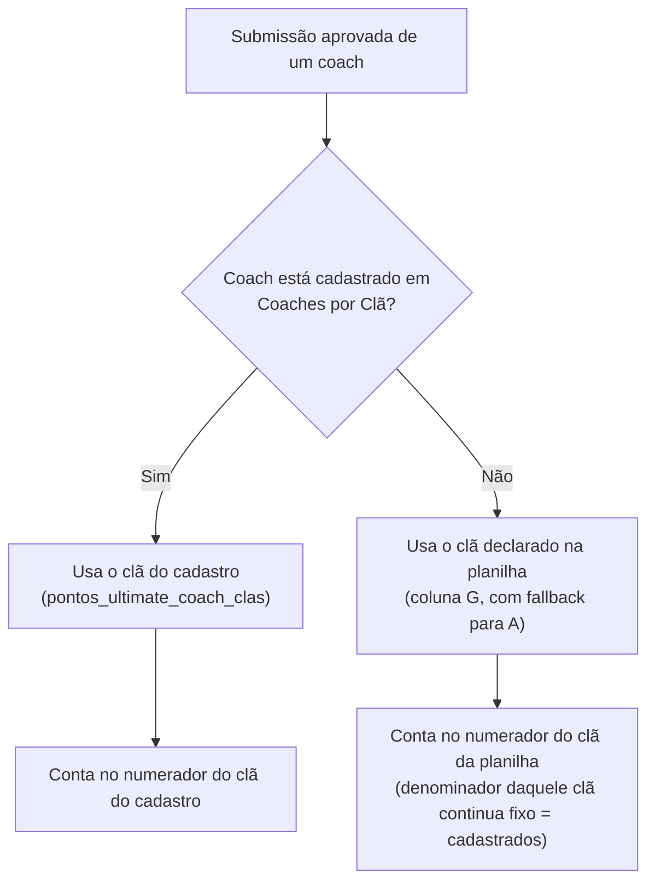

# PRD: Apuração de Desafios por Clã — Percentual de Participação

**Documento de Requisitos de Produto (PRD)**
**Data:** 11/09/2026
**Status:** Proposto — aguardando planejamento técnico
**Repositório:** `Alberanif/contabilidade_pontos_py`
**Autor:** Claude Sonnet 5 & Time de Engenharia IGT

---

## 1. Visão Geral e Contexto Executivo

Hoje, a contabilização de pontos de desafio por clã é puramente aditiva: cada submissão elegível na planilha oficial (Google Sheets) vale `POINTS_PER_DESAFIO_SUBMISSION` pontos fixos (10 por padrão, `backend/config.py`), somados ao clã declarado na própria linha, a cada sincronização (`desafio_reconciliation.py`, aplicado via RPC `apply_desafio_reconciliation`, migração `009`). Não existe nenhuma noção de "quantos coaches do clã participaram, proporcionalmente ao tamanho do clã" — um clã com 20 coaches e um clã com 5 coaches pontuam da mesma forma por submissão, e não há prazo de encerramento: o desafio permanece "aberto" (recebendo e revertendo pontos) indefinidamente, enquanto houver linhas na planilha.

Este PRD substitui esse modelo, para desafios novos, por uma regra de **engajamento proporcional**: o clã ganha pontos de acordo com o **percentual de coaches do próprio clã que participaram e tiveram sua submissão aprovada**, apurado uma única vez, no encerramento do prazo do desafio — não cumulativo, e não mais um valor fixo por submissão.

Esta mudança também é o gancho, já previsto desde a fase anterior, para conectar a feature **"Coaches por Clã"** (cadastro central coach → clã, `pontos_ultimate_coach_clas`, PRD de 10/09/2026) à contabilização de pontos: o cadastro passa a ser a fonte de verdade de "a qual clã este coach pertence" e de "quantos coaches tem esse clã" (o denominador do percentual).

Adicionalmente — e isto é uma mudança de critério que vai além do cálculo do clã — a coluna "Validado" da própria planilha deixa de decidir, sozinha, se uma submissão conta. Ela é substituída por uma **aprovação manual** (aceitar/rejeitar) feita por um administrador dentro do próprio sistema, e esse novo critério passa a valer tanto para os pontos do clã quanto para os pontos individuais do coach (Fase 2, já existente).

Para não reprocessar retroativamente todo o histórico já pontuado, tudo isto (regra de percentual do clã e aprovação manual) vale **somente a partir de 01/08/2026** (data de "Enviado em" da submissão). Tudo que veio antes permanece congelado no modelo anterior.

---

## 2. Objetivos e Métricas de Sucesso

### 2.1 Objetivos Principais

1. **Pontuar o engajamento relativo do clã, não o volume bruto de submissões.** Um clã pequeno com 90% de participação deve pontuar mais que um clã grande com 20% de participação.
2. **Usar o cadastro "Coaches por Clã" como fonte de verdade de composição do clã**, tanto para saber a qual clã um coach pertence quanto para saber o tamanho do grupo (denominador do percentual) — primeira integração real dessa tabela com a contabilização de pontos.
3. **Dar controle humano explícito sobre o que conta.** Nenhuma submissão conta para pontos (nem do clã, nem do coach) sem uma decisão explícita de aprovação por um administrador, substituindo a validação automática da própria planilha.
4. **Apuração previsível e auditável por desafio.** Cada desafio tem um prazo definido pelo admin; a apuração final acontece uma vez, é visível separadamente por clã, e só é refeita se o prazo for reaberto deliberadamente.
5. **Convivência sem quebra do histórico.** Desafios e submissões anteriores a 01/08/2026 continuam valendo exatamente como hoje, sem reprocessamento nem exigência de revisão retroativa.

### 2.2 Métricas de Sucesso (KPIs)

- **Correção da fórmula:** para todo desafio apurado a partir de 01/08/2026, os pontos gravados para cada clã batem exatamente com a tabela de faixas aplicada à fração exata `aprovados / total_cadastrado_no_cla`.
- **Zero regressão no legado:** nenhum desafio ou submissão com "Enviado em" anterior a 01/08/2026 tem seus pontos (clã ou coach) alterados por esta entrega.
- **Zero contagem sem aprovação:** nenhuma submissão a partir de 01/08/2026 contabiliza pontos (clã ou coach) enquanto estiver com status "pendente".
- **Rastreabilidade:** para qualquer clã e desafio apurado, é possível visualizar na UI quantos coaches participaram, o percentual exato e os pontos correspondentes.

---

## 3. Escopo

### 3.1 Dentro do Escopo (In-Scope)

- Nova regra de pontuação de clã em desafios, por faixa de percentual de participação (tabela na §4), substituindo o modelo de "pontos fixos por submissão" **somente para desafios/submissões a partir de 01/08/2026**.
- Novo critério único de elegibilidade — aprovação manual (aceitar/rejeitar) por submissão — que passa a valer tanto para a pontuação do clã quanto para a pontuação individual do coach (Fase 2), **também somente a partir de 01/08/2026**. A coluna "Validado" da planilha deixa de ter qualquer efeito na contabilização para submissões desse período (permanece só como referência visual/auditoria).
- Uso do cadastro `pontos_ultimate_coach_clas` ("Coaches por Clã") para resolver a qual clã um coach cadastrado pertence (tem prioridade sobre o clã declarado na planilha) e para calcular o tamanho do grupo (denominador) de cada clã.
- Campo de prazo (data-limite) por desafio, definido/editado manualmente pelo admin numa nova seção da tela "Desafios" já existente.
- Apuração automática dos pontos do clã na primeira "Executar Contabilidade" após o prazo vencer.
- Prévia (não definitiva) do percentual de participação de cada clã, visível antes do prazo vencer.
- Reabertura de um desafio já apurado através da edição do prazo, com reapuração na próxima execução após o novo prazo vencer.
- Nova UI de revisão: check/X por submissão (a partir de 01/08/2026), na tela "Desafios".
- Quebra visual, por desafio, do percentual e dos pontos obtidos por cada clã (além do total geral do clã, que continua existindo como hoje).

### 3.2 Fora do Escopo (Out-of-Scope)

- Qualquer reprocessamento retroativo de desafios/submissões com "Enviado em" anterior a 01/08/2026 — ficam congelados no modelo atual (pontos fixos por submissão, elegibilidade pela coluna "Validado").
- Qualquer mudança na forma como Registros e Pro-bono são contabilizados — esta mudança é só para Desafios.
- Autenticação/autorização por papel para quem pode aprovar/reprovar submissões ou definir prazos — mantém o mesmo nível de acesso (sem controle de usuário) do restante do painel administrativo hoje.
- Prazo padrão automático ou bloqueio de "Executar Contabilidade" para desafios sem prazo definido — um desafio sem prazo simplesmente nunca é apurado (fica em 0 pontos de clã), sem alerta ativo além da própria tela mostrar "sem prazo definido".
- Recontagem automática de um desafio já apurado quando uma submissão é aprovada/reprovada depois do prazo — só uma edição explícita do prazo reabre a apuração.
- Nova coluna na planilha do Google Sheets — o prazo e a aprovação manual são geridos inteiramente dentro do sistema, sem exigir mudança no contrato de 9 colunas hoje lido por `desafio_sheet_parser.py`.
- Ações em lote (aprovar/reprovar várias submissões de uma vez) — cada submissão é revisada individualmente nesta fase.

---

## 4. Regra de Negócio — Tabela de Faixas de Pontuação do Clã

Para cada desafio apurado (a partir de 01/08/2026), cada clã recebe pontos conforme a faixa em que cai seu percentual de participação:

| Participação do clã | Pontos |
|---|---|
| 0% (ninguém participou) | 0 |
| 0,01% a 9,99% | 0 |
| 10% a 30% | 300 |
| 31% a 40% | 400 |
| 41% a 50% | 500 |
| 51% a 60% | 600 |
| 61% a 70% | 700 |
| 71% a 80% | 800 |
| 81% a 90% | 900 |
| 91% a 100% | 1000 |

**Regras de cálculo:**

- `percentual = participantes_aprovados / total_cadastrado_no_cla` — **fração exata**, sem arredondamento, comparada diretamente contra os limites das faixas acima (ex.: 3 de 17 = 17,64...%, cai em "10% a 30%" = 300 pontos, sem arredondar para 18%).
- Não cumulativo: o valor gravado para o clã naquele desafio é sempre o valor da tabela para o percentual final apurado — não é uma soma incremental de pontos por submissão.
- Se `participantes_aprovados > total_cadastrado_no_cla` (caso de coach não cadastrado contando pelo clã declarado na planilha — ver §7.3), o percentual é travado em 100% (faixa máxima, 1000 pontos); não existe faixa acima de 100%.
- `total_cadastrado_no_cla` = 0 (clã sem nenhum coach cadastrado em "Coaches por Clã") → percentual indefinido, tratado como 0%/0 pontos.

Esta tabela é implementada como função pura (ex.: `calcular_pontos_por_percentual(percentual: float) -> int`), na mesma linha de `desafio_sheet_parser.normalize_clan()` — sem necessidade de configuração externa, já que é uma regra de negócio fixa.

---

## 5. Corte de Vigência: 01/08/2026

Toda a mudança descrita neste PRD — regra de percentual do clã **e** critério de aprovação manual — aplica-se exclusivamente a submissões cuja data "Enviado em" (`submitted_at`, coluna H da planilha) seja **em ou após 01/08/2026**.

| | Antes de 01/08/2026 | A partir de 01/08/2026 |
|---|---|---|
| Elegibilidade | Coluna "Validado" da planilha (`status == 'active_counted'`) | Aprovação manual (check/X) do admin no sistema |
| Pontos do clã | 10 pontos fixos por submissão elegível, somados incrementalmente (modelo atual) | Tabela de faixas por percentual, apurada uma vez no prazo do desafio |
| Pontos do coach | 10 pontos por submissão elegível (Fase 2, inalterado) | 10 pontos por submissão aprovada (mesma fórmula, novo critério de elegibilidade) |
| Estado | Congelado — nenhum reprocessamento retroativo | Fluxo novo, ativo |

Um desafio cuja primeira submissão já ocorreu antes de 01/08/2026 permanece inteiramente no modelo antigo, mesmo que receba novas submissões depois dessa data (não se espera que isso ocorra na prática, mas caso ocorra, o desafio como um todo já nasceu "antes do corte" e não migra de regra no meio do caminho — a decisão de regra é por submissão, pela própria data daquela submissão, não pela idade do desafio; ver nota técnica na Fase de Deploy, §13).

---

## 6. Novo Critério Único de Elegibilidade — Aprovação Manual

A partir de 01/08/2026, cada submissão (linha da planilha, identificada por `token`) ganha um estado de revisão, controlado por um administrador na UI:

```
pendente  →  aprovado   (conta pontos: clã e coach)
          →  reprovado  (fica registrado, nunca conta pontos)
```

- **Estado inicial: `pendente`.** Toda submissão nova (a partir do corte) nasce pendente e não conta para nada até ser revisada.
- **Granularidade: por submissão (token), não por coach+desafio.** Se um coach preencher a planilha duas vezes para o mesmo desafio, cada linha tem seu próprio check/X. O coach conta como participante do desafio (para o percentual do clã) se **pelo menos uma** de suas submissões estiver aprovada.
- **Reversível a qualquer momento**, exceto quanto a efeito retroativo em desafio já apurado (§8.4): aprovar/reprovar uma submissão de um desafio ainda não apurado (ou reaberto) afeta o cálculo já na próxima execução.
- **Só chega para revisão o que já é estruturalmide válido.** Uma linha que já seria `invalid` ou `conflicted` pelas regras estruturais existentes (nome/desafio/data/token ausentes, ou conflito de clã entre colunas A e G — `desafio_sheet_parser.py`) nunca conta, independentemente de aprovação — essas continuam sendo filtradas automaticamente, como hoje, e não aparecem como pendentes de revisão.
- **A coluna "Validado" da planilha permanece visível** na auditoria de submissões (referência/contexto para quem revisa), mas não tem mais nenhum efeito sobre pontos para submissões deste período.
- **Efeito duplo:** aprovar uma submissão a partir do corte contribui, na mesma operação lógica, tanto para o total individual do coach (10 pontos, na próxima "Executar Contabilidade", igual ao modelo incremental de hoje) quanto para a contagem de participação do clã naquele desafio (usada só quando o desafio for apurado, no prazo).

---

## 7. Motor de Cálculo — Numerador, Denominador e Resolução de Clã

### 7.1 Numerador (participantes aprovados de um clã, num desafio)

Número de coaches **distintos** (nome canônico, resolvido via `coach_identity.resolve_coach()` + `supabase_client.get_coach_alias_map()`, igual ao resto do sistema) que têm **pelo menos uma submissão `aprovado`** para aquele desafio específico, atribuídos àquele clã pela regra de resolução da §7.3.

### 7.2 Denominador (tamanho do grupo de um clã)

Número de coaches cadastrados naquele clã em `pontos_ultimate_coach_clas` ("Coaches por Clã"), **contado no momento em que o desafio é apurado** (não um snapshot fixado na criação do desafio) — reflete o cadastro mais atual disponível.

### 7.3 A qual clã um coach pertence, para fins de participação



- **Coach cadastrado:** o clã do cadastro **sempre vence**, mesmo que a planilha do desafio declare um clã diferente para ele. Divergências ficam registradas para auditoria (log/relatório), mas não mudam o resultado — esta é a razão de ser da integração com "Coaches por Clã".
- **Coach não cadastrado** (nome, mesmo após resolução de alias, não está em nenhum dos 8 clãs do cadastro): conta pelo clã que a própria planilha declarar para ele (resolução de conflito A/G já existente em `desafio_sheet_parser._resolve_clan`). Como o denominador desse clã é fixo (§7.2, só cadastrados), isso pode fazer o percentual passar de 100% — nesse caso, trava em 100% (§4).

---

## 8. Ciclo de Vida do Prazo e da Apuração

### 8.1 Definição do prazo

Cada desafio (cuja regra é a nova, §5) ganha um campo de prazo (`prazo_apuracao`, data/hora), definido e editável manualmente por um admin na tela "Desafios". Não há prazo padrão nem obrigatoriedade — um desafio sem prazo definido nunca é apurado (fica em 0 pontos de clã indefinidamente), o que fica visível na UI como "sem prazo definido".

### 8.2 Prévia antes do prazo vencer

Enquanto o prazo não venceu, a tela mostra, por clã, o percentual de participação **provisório** (calculado com as aprovações até o momento), rotulado claramente como prévia — não gera pontos ainda.

### 8.3 Apuração automática

Quando o prazo de um desafio é atingido, a apuração final (percentual → pontos, tabela §4) acontece automaticamente na **próxima** execução de "Executar Contabilidade" (`POST /api/contabilidade/executar`) após aquele momento — sem ação manual extra além de já ter definido o prazo. O resultado (percentual, participantes, total do grupo, pontos) é gravado por clã e por desafio, e o delta correspondente é aplicado ao total do clã (`pontos_ultimate_totais_por_clan`).

### 8.4 Congelamento e reabertura

Uma vez apurado, o desafio fica congelado para aquele clã:

- Aprovar ou reprovar submissões adicionais daquele desafio **não** dispara recálculo automático.
- Só uma edição explícita do prazo (movendo-o para uma data futura) reabre o desafio: o percentual/pontos daquele desafio voltam a "pendente de apuração" e serão recalculados do zero na próxima execução após o novo prazo vencer (o delta anterior é primeiro revertido, depois o novo valor é aplicado — ver §9.3).

---

## 9. Modelagem de Dados (Supabase)

### 9.1 Novo estado de revisão por submissão

Tabela separada (não altera `desafio_submissions_current`, que é gerida integralmente pela engine de reconciliação) para não haver risco de a sincronização periódica sobrescrever uma decisão manual de revisão:

```sql
CREATE TABLE IF NOT EXISTS desafio_submissao_revisoes (
    token         TEXT PRIMARY KEY REFERENCES desafio_submissions_current(token) ON DELETE CASCADE,
    status        TEXT NOT NULL DEFAULT 'pendente'
                      CHECK (status IN ('pendente', 'aprovado', 'reprovado')),
    revisado_por  TEXT,
    revisado_em   TIMESTAMPTZ,
    created_at    TIMESTAMPTZ NOT NULL DEFAULT NOW(),
    updated_at    TIMESTAMPTZ NOT NULL DEFAULT NOW()
);

CREATE INDEX IF NOT EXISTS ix_desafio_submissao_revisoes_status
    ON desafio_submissao_revisoes (status);
```

Uma submissão sem linha nesta tabela é tratada como `pendente` (não é necessário popular a tabela inteira de antemão; a linha é criada no primeiro clique de aprovar/reprovar).

### 9.2 Prazo por desafio

```sql
ALTER TABLE desafios ADD COLUMN IF NOT EXISTS prazo_apuracao TIMESTAMPTZ;
ALTER TABLE desafios ADD COLUMN IF NOT EXISTS apurado_em TIMESTAMPTZ;
```

**Nota de nomenclatura:** deliberadamente **não** reaproveita as colunas legadas `data_inicio`/`data_fim` (de `003_add_desafios.sql`, usadas pelo antigo motor de importação manual/CSV, hoje bloqueado — `desafio_import_engine.py`), para não misturar semânticas de dois fluxos diferentes. `prazo_apuracao` é exclusivo desta regra nova.

### 9.3 Resultado da apuração por clã

```sql
CREATE TABLE IF NOT EXISTS desafio_clan_apuracoes (
    id                    SERIAL PRIMARY KEY,
    desafio_id            INTEGER NOT NULL REFERENCES desafios(id) ON DELETE CASCADE,
    clan                  TEXT NOT NULL,
    participantes         INTEGER NOT NULL CHECK (participantes >= 0),
    total_grupo           INTEGER NOT NULL CHECK (total_grupo >= 0),
    percentual            NUMERIC NOT NULL,
    pontos                INTEGER NOT NULL CHECK (pontos >= 0),
    apurado_em            TIMESTAMPTZ NOT NULL DEFAULT NOW(),
    UNIQUE (desafio_id, clan)
);
```

- Uma linha por `(desafio, clã)`, sobrescrita (`UPSERT`) a cada nova apuração daquele desafio — guarda sempre o resultado vigente, usado tanto para exibição (§10.2) quanto para calcular o delta a aplicar/reverter em `pontos_ultimate_totais_por_clan` quando o desafio é reaberto e reapurado (§8.4): reverte `pontos` do registro anterior, depois aplica o novo `pontos` calculado.

### 9.4 Corte de vigência

Constante de configuração (`backend/config.py`), no mesmo padrão de outras datas de corte já existentes no sistema (ex.: `points_engine.py`, corte de data para pontuação individual):

```python
# Desafios com "Enviado em" a partir desta data usam o novo critério de
# aprovação manual e a regra de percentual por clã; anteriores permanecem
# no modelo antigo (coluna "Validado", pontos fixos por submissão).
DESAFIO_PERCENTUAL_CLAN_CORTE = date(2026, 8, 1)
```

---

## 10. Especificação das APIs Backend (FastAPI)

Extensões em `backend/routers/desafio_auditoria.py` (ou um novo router dedicado, ex. `backend/routers/desafio_apuracao.py`, montado também sob `/api/desafios`):

### 10.1 `PATCH /api/desafios/{id}/prazo`

Define ou edita o prazo de apuração de um desafio.

- **Body:** `{ "prazo_apuracao": "2026-09-30T23:59:59-03:00" }` (ou `null` para remover o prazo).
- Reabrir um desafio já apurado (mover o prazo para o futuro) marca o desafio como pendente de nova apuração — sem apagar o resultado anterior imediatamente (só é substituído quando a nova apuração de fato rodar).

### 10.2 `GET /api/desafios/{id}/apuracao`

Retorna, por clã, o estado de participação daquele desafio — prévia (se ainda não apurado) ou resultado final (se já apurado).

```json
{
  "desafio_id": 42,
  "prazo_apuracao": "2026-09-30T23:59:59-03:00",
  "apurado_em": null,
  "provisorio": true,
  "clas": [
    { "clan": "CLÃ 1", "participantes": 6, "total_grupo": 20, "percentual": 30.0, "pontos": 300 },
    { "clan": "CLÃ 2", "participantes": 0, "total_grupo": 20, "percentual": 0.0, "pontos": 0 }
  ]
}
```

### 10.3 `POST /api/desafios/submissoes/{token}/revisar`

Aprova ou reprova uma submissão individual.

- **Body:** `{ "status": "aprovado" }` ou `{ "status": "reprovado" }`.
- Idempotente: pode ser chamado novamente para trocar a decisão a qualquer momento (ver limite em §8.4 quanto a efeito em desafio já apurado).

### 10.4 Camada de dados (`supabase_client.py`)

Novas funções:
- `set_desafio_prazo(desafio_id: int, prazo: datetime | None) -> dict`
- `revisar_submissao(token: str, status: Literal["aprovado", "reprovado"], revisado_por: str | None) -> dict`
- `get_desafio_apuracao(desafio_id: int) -> dict` (calcula prévia ou lê resultado gravado)
- `list_submissoes_pendentes(desafio_id: int) -> list[dict]`

### 10.5 Motor de apuração (novo módulo, ex. `backend/desafio_percentual_clan.py`)

Função pura central:

```python
def calcular_pontos_por_percentual(percentual: float) -> int: ...

def apurar_desafio(
    submissoes_aprovadas: list[SubmissaoAprovada],  # token, coach_raw, clan_planilha
    coach_clas: dict[str, str],                      # coach canônico -> clã cadastrado
    tamanho_grupo_por_clan: dict[str, int],
) -> dict[str, ApuracaoClan]: ...
```

Chamado a partir de `desafio_sync_service.sync_desafios()` (ou de um novo passo equivalente executado na mesma chamada de "Executar Contabilidade"), para todos os desafios cujo `prazo_apuracao` já passou e `apurado_em` ainda é anterior a esse prazo (ou nulo).

---

## 11. Requisitos de Interface (Frontend)

Nova seção dentro da tela **"Desafios"** já existente (`frontend/src/pages/Desafios.tsx`), por desafio:

### 11.1 Prazo

- Campo de data/hora (editável) para definir/editar `prazo_apuracao`.
- Indicador textual do estado: "sem prazo definido" / "em andamento até dd/mm/aaaa hh:mm" / "apurado em dd/mm/aaaa hh:mm".

### 11.2 Revisão de submissões

- Lista de submissões daquele desafio (reaproveitando o que já existe em `SubmissionDetail.tsx`/`SyncRunDetail.tsx`), cada linha com dois botões: **✓ Aprovar** / **✗ Reprovar**, e o estado atual (pendente/aprovado/reprovado) visível como badge.
- Coluna "Validado" da planilha continua visível, mas claramente marcada como informativa (ex.: tooltip "não afeta mais a pontuação").

### 11.3 Percentual e pontos por clã

- Por desafio, uma tabela/lista com uma linha por clã: participantes / total do grupo / percentual / pontos.
- Antes do prazo vencer: rótulo "prévia — ainda não apurado".
- Depois de apurado: rótulo "apurado em dd/mm/aaaa hh:mm", sem alterar mais a menos que o prazo seja reaberto.

### 11.4 `src/api/client.ts`

Novas funções: `setDesafioPrazo(desafioId, prazo)`, `getDesafioApuracao(desafioId)`, `revisarSubmissao(token, status)`.

---

## 12. Plano de Testes e Validação

### 12.1 Backend — Unitários

- `test_desafio_percentual_clan.py`: `calcular_pontos_por_percentual` para todas as faixas e limites exatos (0%, 9,99%, 10%, 30%, 30,01%→erro de faixa impossível pela tabela contínua, 100%, >100% travado em 1000); fração exata sem arredondamento (ex.: 3/17).
- `apurar_desafio`: resolução de clã priorizando cadastro sobre planilha; coach não cadastrado cai no clã da planilha; denominador = tamanho do cadastro no momento da chamada; participação binária por coach mesmo com múltiplas submissões aprovadas.
- `test_desafio_submissao_revisoes.py`: estado inicial pendente; aprovar/reprovar idempotente; submissão `invalid`/`conflicted` nunca aparece como revisável.
- `test_desafio_prazo.py`: definir prazo; apuração dispara só após o prazo vencer, na próxima execução; reabrir (mover prazo para o futuro) marca como pendente de nova apuração; sem prazo nunca apura.
- Corte de vigência: submissão com `submitted_at` < 01/08/2026 nunca entra no novo fluxo (nem revisão manual, nem percentual), mesmo que criada/sincronizada depois da mudança estar em produção.

### 12.2 Integração / e2e

- Fluxo completo: sincronizar planilha com submissões após o corte → aprovar algumas → definir prazo no passado (ou deixar vencer) → rodar "Executar Contabilidade" → validar pontos gravados por clã batendo com a tabela de faixas, e pontos individuais do coach batendo com o novo critério de aprovação.
- Reabertura: desafio apurado → editar prazo para o futuro → aprovar mais uma submissão → prazo vence de novo → validar que o delta antigo foi revertido e o novo aplicado corretamente ao total do clã.
- Regressão do legado: desafio/submissão anterior a 01/08/2026 permanece com os mesmos pontos antes e depois da mudança subir para produção.

### 12.3 Frontend (`vitest`)

- `Desafios.test.tsx`: renderização da nova seção (prazo, revisão, percentual/pontos); fluxo de definir prazo; fluxo de aprovar/reprovar uma submissão; exibição de prévia vs. apurado.

---

## 13. Plano de Deploy e Rollout

1. **Fase 1 (Banco de Dados):** aplicar migração com `desafio_submissao_revisoes`, `desafios.prazo_apuracao`, `desafios.apurado_em`, `desafio_clan_apuracoes`.
2. **Fase 2 (Backend — motor de cálculo):** implementar `desafio_percentual_clan.py` (função pura) com testes unitários cobrindo a tabela de faixas e a resolução de clã.
3. **Fase 3 (Backend — critério de elegibilidade e integração com "Executar Contabilidade"):** implementar `desafio_submissao_revisoes`, o gate de corte de vigência (`DESAFIO_PERCENTUAL_CLAN_CORTE`), e o gatilho de apuração automática por prazo vencido.
4. **Fase 4 (Backend — APIs):** endpoints de prazo, revisão e apuração; funções em `supabase_client.py`.
5. **Fase 5 (Frontend):** nova seção na tela "Desafios" (prazo, revisão por submissão, percentual/pontos por clã).
6. **Fase 6 (Homologação):** validar manualmente, em um desafio de teste com data posterior a 01/08/2026, o ciclo completo — pendente → aprovar → prévia → prazo vence → apuração automática → pontos corretos no clã.

---

## 14. Riscos

| Risco | Mitigação |
|---|---|
| Volume de revisão manual (potencialmente dezenas/centenas de submissões por desafio, uma a uma) sobrecarrega o admin | Aceito nesta fase (§3.2, sem ações em lote); candidato natural para uma evolução futura se o volume se mostrar um problema |
| Admin esquece de definir o prazo de um desafio novo | Aceito nesta fase (§8.1) — a tela mostra "sem prazo definido" como lembrete visual, sem trava automática |
| Coach não cadastrado em "Coaches por Clã" distorce o percentual de um clã pequeno (poucos cadastrados, denominador baixo) | Mitigado por `total_grupo` sempre exposto ao lado do percentual na UI (§11.3), permitindo auditoria; incentivo indireto para manter o cadastro "Coaches por Clã" atualizado |
| Divergência entre o clã do cadastro e o clã declarado na planilha, para um coach já cadastrado, passa despercebida (silenciosamente resolvida a favor do cadastro) | Registrar essas divergências em log/relatório de apuração para auditoria posterior (não bloqueante) |
| Reabertura de prazo aplicada sem cuidado poderia, em tese, aplicar o delta errado se dois processos rodarem "Executar Contabilidade" simultaneamente | Mesma proteção transacional já usada pelo motor de reconciliação de desafios (RPC Postgres, migração `009`) deve ser estendida à apuração por percentual |

---

## 15. Fora de Escopo / Evoluções Futuras

- Reprocessamento retroativo de desafios anteriores a 01/08/2026 sob a nova regra.
- Ações de aprovação em lote.
- Papéis/permissões diferenciados para quem pode aprovar submissões ou definir prazos.
- Prazo padrão automático ou qualquer travamento de "Executar Contabilidade" por desafio sem prazo.
- Alertas/notificações automáticas de prazo próximo do vencimento.

---

**Aprovado por:**
- *Engenharia IGT*
- *Claude Sonnet 5 (Anthropic)*
